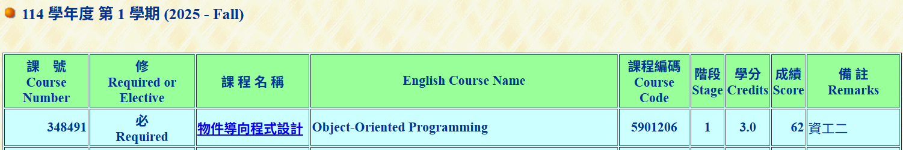

# Abstract

遊戲名稱: Plant vs Zombie

組員：

- 113590036 蘇玫人

# Game Introduction

Plant vs. Zombies is a classic tower defense game. Players must plant various types of functional plants on their lawn to defend against an incoming horde of zombies.

This project is aimed at recreating the first major stage (Level 1-1 to Level 1-10(if possible)). 

[遊戲連結](https://www.youtube.com/watch?v=2BGA79PKaZ8)

# Development timeline

Week 02: Project Proposal

[ ] Finalize game scope and project structure

[ ] Initialize PTSD engine environment

Week 03: Asset Collection (Entities)

[ ] Collect plant and zombie sprites/assets

[ ] Design the game grid dimensions

Week 04: Asset Collection (Environment)

[ ] Collect map background and tile assets

[ ] Design UI layout (Seed selection and Sun display)

Week 05: Map System

[ ] Construct the game map within the engine

[ ] Implement plant placement validation logic

Week 06: Zombie System

[ ] Create the "Normal Zombie" character class

[ ] Implement zombie movement and state logic

Week 07: Plant System

[ ] Create "Sunflower" and "Peashooter" classes

[ ] Implement the core planting functionality

Week 08: Combat System

[ ] Implement plant attacking logic (Projectiles)

[ ] Implement zombie attacking logic (Eating plants)

Week 09: Midterm Demo

[ ] Implement Sun Generation System (from Sunflowers and skydrops)

[ ] Implement planting currency 

[ ] Showcase a playable demonstration level

Week 10: System Optimization

[ ] Debug issues identified during the Midterm Demo

[ ] Optimize combat and collision detection performance

Week 11: Expanded Plant Roster

[ ] Implement new plant types (e.g., Wall-nut, Cherry Bomb)

[ ] Develop unique abilities and attack patterns

Week 12: Expanded Zombie Roster

[ ] Implement new zombie types (e.g., Conehead Zombie)

[ ] Balance health points and movement speeds

Week 13: Resource System

[ ] Finalize the Sun generation system

[ ] Implement planting costs and consumption mechanics

Week 14: Level Progression (Stage 1: Levels 1.1 - 1.3)

[ ] Design specific wave patterns for early levels

[ ] Balance difficulty and plant availability for 1.1 - 1.3

Week 15: Level Progression (Stage 2: Levels 1.4 - 1.5)

[ ] Design wave patterns and difficulty scaling for Levels 1.4 - 1.5

[ ] Test end-to-end gameplay loop for the first five levels

Week 16: Animation & Audio

[ ] Integrate attack animations and visual feedback

[ ] Implement game music and sound effects via PTSD

Week 17: Testing, Final Polish, & Final Submission

[ ] Conduct end-to-end testing of levels

[ ] Fix remaining bugs and fine-tune game balance

[ ] Record gameplay demonstration video

[ ] Prepare final project presentation

[ ] Submit all deliverables

## 長頸鹿通關

## OOP 修課證明

